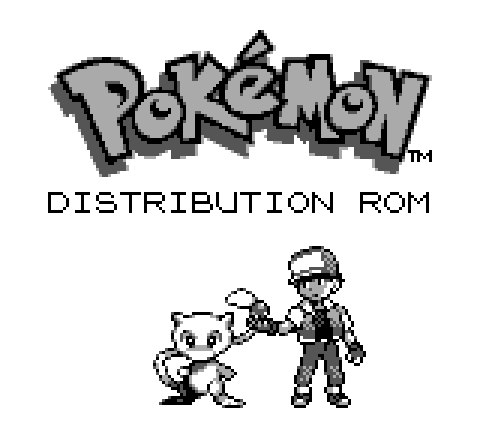
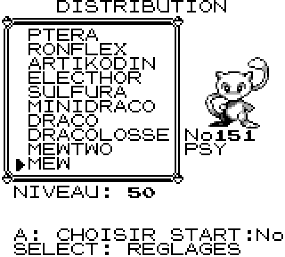
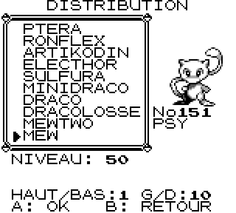
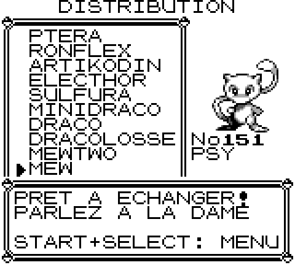

# Pokémon Distribution ROM [![Build Status][ci-badge]][ci]

An event-distribution cart for the French Pokémon Rouge and Bleue. It boots
into a menu. You pick any of the 151 Pokémon and a level, then trade that
Pokémon to a real cartridge over a link cable.

<p align="center">
  
  
  <br>
  
  
</p>

## How it works

This is a fork of the French pokered disassembly. The other Game Boy runs a
retail cartridge, so the link protocol has to match it byte for byte. The menu
builds a one-Pokémon party in WRAM and then hands off to the game's own Cable
Club code, which is unchanged.

The gift is a valid Pokémon. It has the right stats for its level, a level-up
moveset, random DVs, the species name as its nickname, and your name plus a
random ID as its OT.

## Controls

**Pokémon list**

| Button | Action |
| --- | --- |
| Up / Down | Move one entry. Hold to repeat. Wraps, so Mew is one press up from Bulbizarre |
| Left / Right | Page by 10 |
| Start | Jump to a Pokédex number |
| Select | Settings |
| A | Choose this Pokémon |

**Level**

| Button | Action |
| --- | --- |
| Up / Down | ±1 |
| Left / Right | ±10 |
| A | Confirm |
| B | Back to the list |

**Anywhere**

| Button | Action |
| --- | --- |
| Start + Select, held half a second | Back to the menu |

Start + Select resets the cart between visitors, with no power cycle. It does
nothing during a link session, so you cannot drop a trade halfway.

## Settings

Press Select on the list. `NOM:` sets the OT name stamped on every gift. It
defaults to `OneSear` and holds 7 characters. The name and the level are both
kept when you press Start + Select.

## Build

You need [rgbds](https://rgbds.gbdev.io/) 0.9.3 or newer. See
[INSTALL.md](INSTALL.md) for setup.

```sh
make
```

This writes `pokemon_distribution.gb`, 1 MB. A clean rebuild is byte-identical.
The extension is `.gb` because the CGB flag at `$0143` is `$00`. The ROM runs on
a Game Boy, a Super Game Boy and a Game Boy Color.

## Handing out a Pokémon

1. Boot the cart and press Start.
2. Press Select if you want to change the OT name.
3. Pick a Pokémon with A, set the level, press A again.
4. Press A once more. You are now in a Pokémon Center, in front of the link
   receptionist.
5. Connect the two Game Boys. Send the other player to any Cable Club, then
   talk to the receptionist on both ends and trade.
6. Press Start + Select for the next visitor.

The cart trades its only Pokémon away, so step 6 builds a fresh one.

## What was changed

| File | |
| --- | --- |
| `engine/menus/distribution.asm` | the menu, sprite preview, settings and party builder |
| `gfx/distribution_banner.asm` | the "DISTRIBUTION ROM" banner |
| `engine/movie/title.asm` | new banner, Mew on the title, Start opens the menu |
| `home/init.asm` | skips the intro battle |
| `engine/joypad.asm` | the Start + Select hook |
| `main.asm`, `layout.link`, `ram/wram.asm` | bank `$2D` and its WRAM |
| `Makefile` | one target instead of four |

The Cable Club, the trade code, the sprites and the text engine are untouched.

## Status

Tested in PyBoy on DMG and CGB: all 151 list entries and preview sprites, the
scrolling and paging, the party bytes against the Gen 1 stat formula, and the
Start + Select return.

The link trade itself is untested. That needs two SameBoy instances or real
hardware.

Screenshots come from [`docs/capture_screenshots.py`](docs/capture_screenshots.py),
which drives the SameBoy libretro core. Run it after `make` to redo them.

## Credits

Built on [pret/pokered][pokered] and the French fork
[einstein95/pokered-fr][pokered-fr].

Pokémon is a trademark of Nintendo, Creatures and GAME FREAK. This repository
holds no game data. You build the ROM from source yourself.

[pokered]: https://github.com/pret/pokered
[pokered-fr]: https://github.com/einstein95/pokered-fr
[ci]: https://github.com/OneSear/pokemon-distribution-rom/actions
[ci-badge]: https://github.com/OneSear/pokemon-distribution-rom/actions/workflows/main.yml/badge.svg
